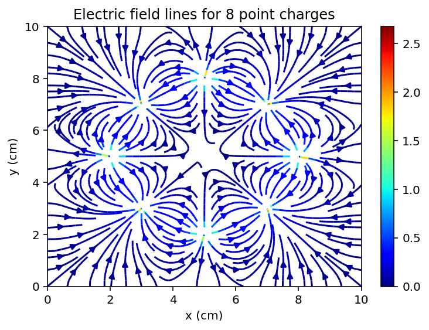
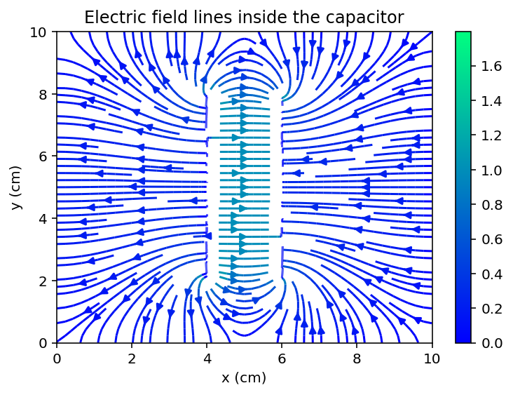

# Electrostatic Potential – Numerical Simulation

## Overview

This project simulates the electrostatic potential and electric field in two different systems: point-charge configurations and a parallel-plate capacitor.

The potential is computed on a two-dimensional grid using an iterative relaxation method, and the electric field is obtained from the numerical gradient of the potential.

---

## Model & Method
- Electrostatic potential on a 2D grid  
- Point-charge configurations inside a square region  
- Parallel-plate capacitor with adjustable plate separation  
- Iterative relaxation method (finite difference approach)  
- Electric field computed from the numerical gradient  
- Visualisation of potential maps and field lines  

---

## Results

### Electric field lines for point-charge configuration



### Electric field lines inside the capacitor (2 cm separation)



The results show how the geometry and charge distribution determine the structure of the electric field, from complex multi-charge interactions to the nearly uniform field inside a capacitor.

---

## How to run

Run the script:

```bash
python electrostatics_simulation.py
```

By default, the script runs:
- Point-charge configuration (8 charges)

To explore other simulations, enable interactive mode:

```python
main(mode="interactive")
```

Available cases:

- Point-charge configurations (2 setups)
- Parallel-plate capacitor

---

## Notes

- Grid size: 101 × 101 points
- Electric field is computed from the numerical gradient of the potential
